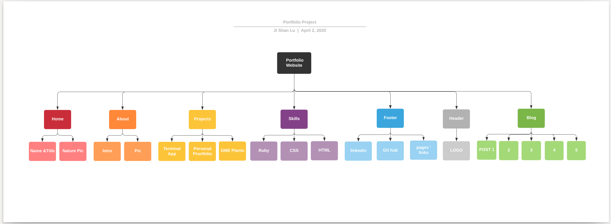
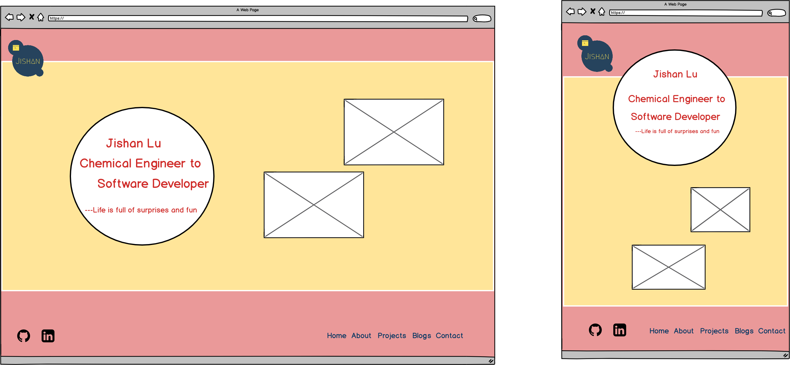
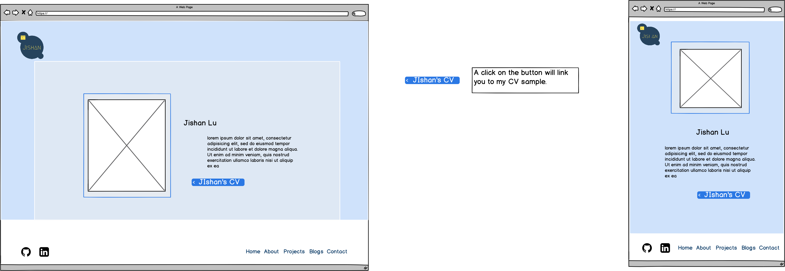
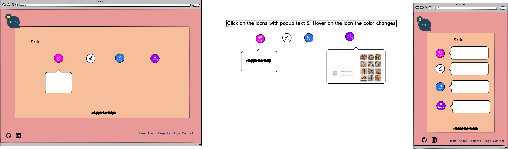
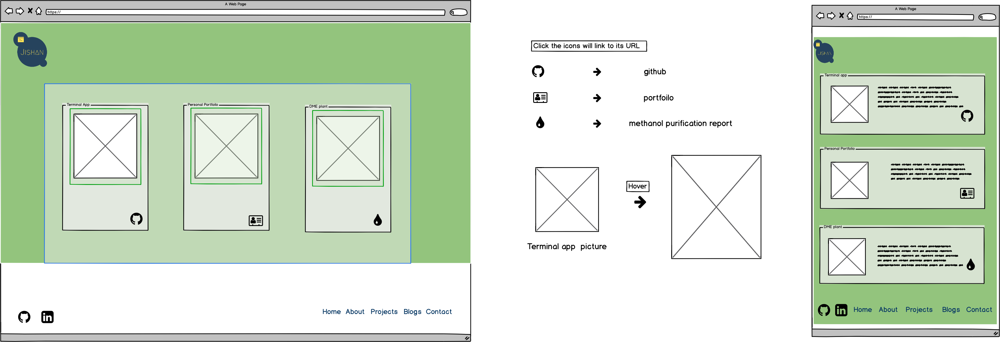
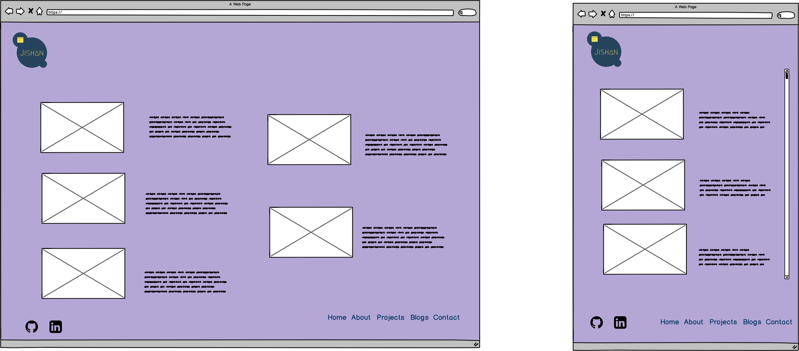
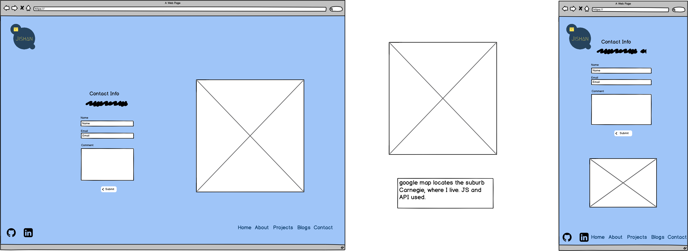

# Jishan Lu Portfolio Website

Website: https://jishan.netlify.com/
Github: https://github.com/jishan33/Jishan_Lu_Portfolio_Website_T1A3

# Purpose

The purpose of this portfolio website is to demonstrate my skills, projects, hobbies and deliver this information to the future employers, recruiters, colleagues and friends. This website has the potential to increase my visibility and subsequentially get more attention from people in the technology field. It can also serve as a contact point for people who want to get in touch with me.

This portfolio website is also a demonstration of my technical skills around HTML and CSS. It has taken into account things like responsive design and security (SDI keys). These elements are discussed more below.

# Functionality and Features

## Responsiveness

Each page has been designed to target both desktop sized browsers as well as mobile. The target phone used for testing was a pixel 2 XL.

The responsiveness of each page is done using media queries to make sure that pages are still viewable on different sized devices.

Percentages have been used to size componenets wherever possible to make sure that the layout looks good when you resize your screen.

## Navigation

The navigation bar on the bottom right of the page allows easy access to all parts of the website with a click.

It is located in the same position on each page to make navigating around very easy and titled with what each page is to make it clear where each link will take you.

On the left side of the page opposite the navigation I've also put links to my GitHub and LinkedIn profiles.

## CV Download

On my about page I have included a link to download my CV. This is so that recruiters coming to my page or referred to my page can more easily access my CV for their reference.

I have implemented this as a link to a google doc. This makes it really easy for me to update my CV without needing to upload a new version of the file anywhere.

## Contact Form

I have also created a contact form which includes a map of the area I live in. This helps people to get in touch with me.

This is implemented by using a HTML form. I've also used [Formspree](https://formspree.io/) for the backend to my form which will email me when someone wants to get in touch.

## CSS Gradients

CSS Gradients have been used to give each page on the site a distinctive and interesting look that doesn't require any images to be downloaded.

This makes the page very quick to load whilst still being visually interesting to the viewer.

This isn't supported on all browsers yet so the site is best viewed on Chrome, however on Firefox it will fall back to a single colour which still allows each page to be visually distinct. Support for css gradients in Firefox should be coming soon.

## Animations

In order to add some interactivity on the site, I have added some animations and popups on the skills page. The icons for each technology I am familiar with give a quick overview of my skills and they can each be clicked if someone wants to know more details about each one. This will cause a window to fade in/out with more information.

## SRI (Subresource Integrity)

Subresource Integrity ([SRI](https://www.srihash.org/)) is a feature that protects against modification of your code by 3rd parties when using them to host your site.

Given that my page is being hosted by a 3rd party ([Netlify](https://www.netlify.com/)) I have included this in my website for my stylesheets.

Protecting against this kind of modification is important as otherwise my site's resources could be changed without my permission and my personal site used to distribute malware or serve ads without my consent.

## Sitmap

## Wireframe Screenshots

## Target audience

 - Recruiters
 - Colleagues
 - Friends

## Tech stack

 * HTML
 * SCSS
 * Formsfree
 * Balsamiq
 * Lucidchart
 * Netlify

 

